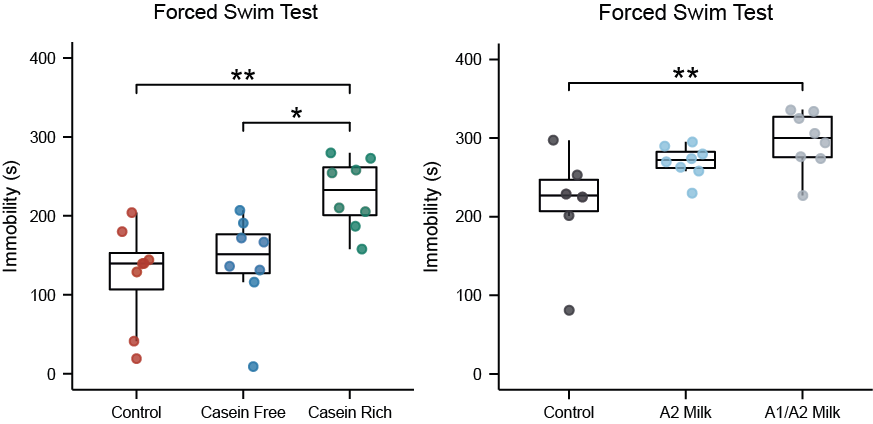
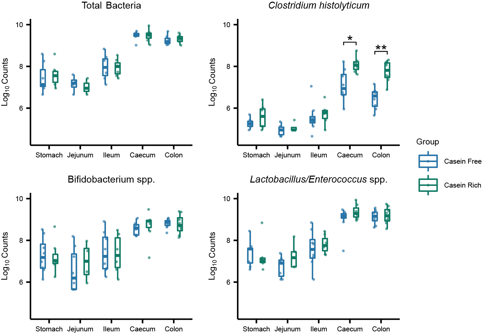
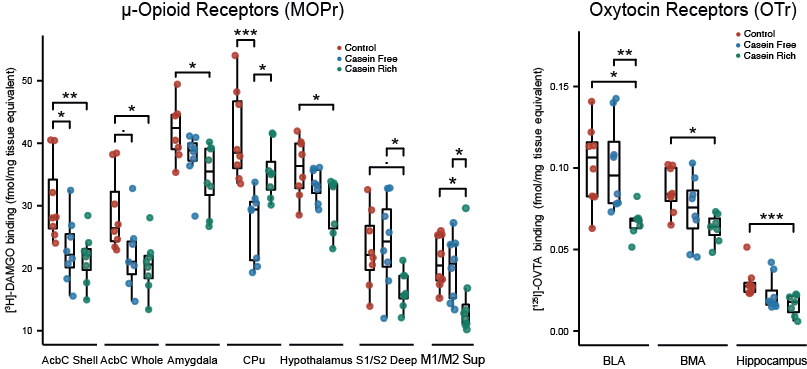
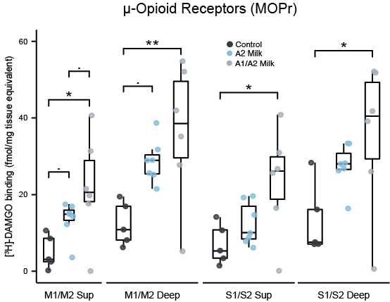
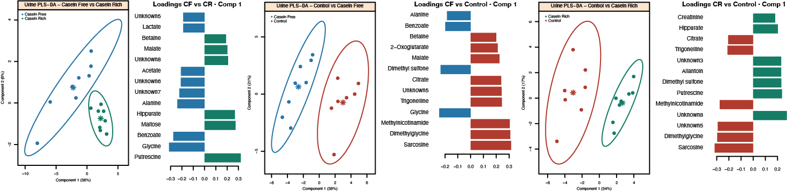
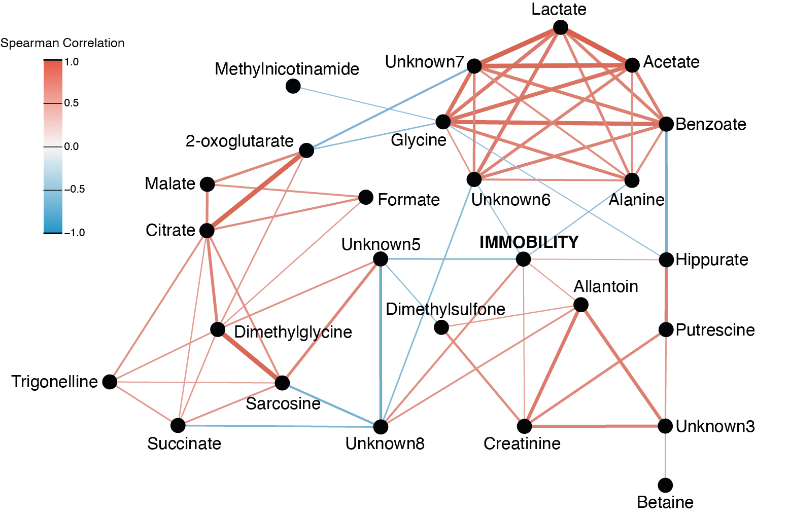
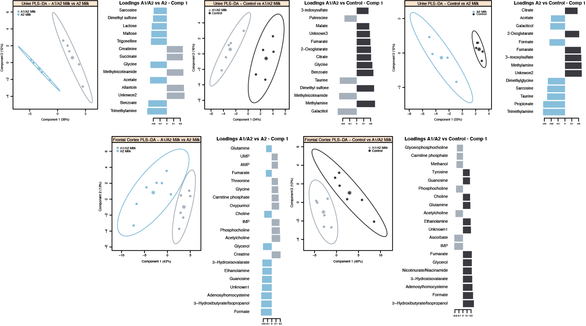
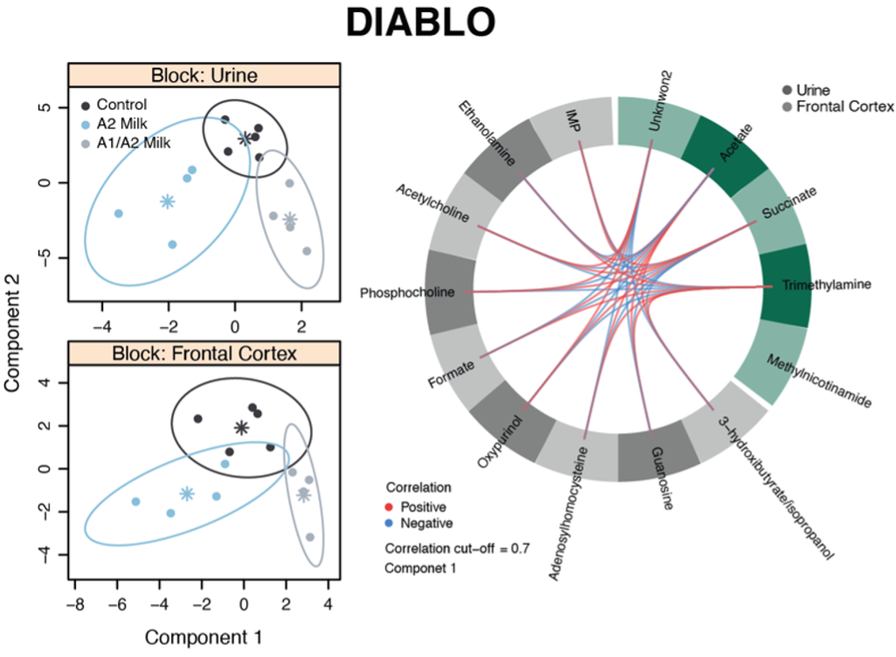
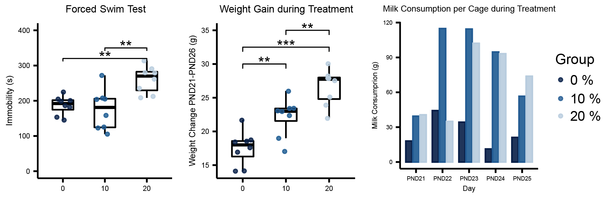
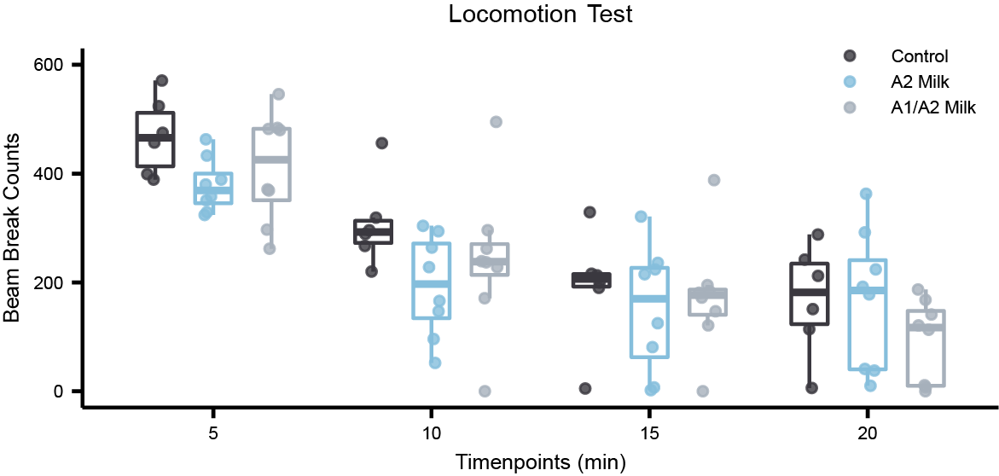

```{r Parameters, include = FALSE, eval=TRUE}

# Output directory
save_dir <- "Figures" 
if (!dir.exists(save_dir)) { stop(paste("save_dir", save_dir, "does not exist")) }

# Palettes
palCasein <- c("#B03A2E", "#2874A6", "#117A65")
palA1A2 <- c("#3A383F","#85BEDC", "#A6B0BB") # palette Korora from Manu package
palDose <- c("#011f4b", "#005b96", "#b3cde0")

```

```{r Setup, include = FALSE, eval=TRUE}

knitr::opts_chunk$set(echo = TRUE, warning = FALSE, eval = FALSE, fig.align = "center")

set.seed(123)

pkgs <- c("tidyverse", "ggpubr", "mixOmics", "RColorBrewer", "Manu", "car", "gtools", "rstatix",
          "Hmisc", "corrplot", "igraph", "ggraph", "RCy3", "ropls")

lapply(pkgs, require, character.only = TRUE)

```

```{r Functions, include = FALSE, eval=TRUE}

# Function - flatten correlation matrix (from STHDA website)
flattenCorrMatrix <- function(cormat, pmat) {
  ut <- upper.tri(cormat)
  data.frame(
    row = rownames(cormat)[row(cormat)[ut]],
    column = rownames(cormat)[col(cormat)[ut]],
    cor  =(cormat)[ut],
    p = pmat[ut]
  )
}

```

```{r Data, include = FALSE, eval=TRUE}

load("Casein_Data.Rdata")

```

# FORCED SWIM TEST - Figure 1B and Figure 3B

Immobility time during the Forced Swim Test (FST) was recorded for animals receiving different treatments in both the Casein Study and the A1/A2 Study. Increased immobility time is indicative of a depressive-like behaviour. One-way ANOVA, followed by Tukey's HSD post-hoc test, was used to compare the mean immobility time between the three different groups in both studies.

```{r FST, results = "hide", message = FALSE, warning = FALSE}

# Check homogeneity of variance and normality of the data to satisfy ANOVA assumptions
Casein_variance <- CaseinData %>% levene_test(Immobility ~ Group) # homogeneous
A1A2_variance <- A1A2Data %>% levene_test(Immobility ~ Group) # homogeneous

Casein_normality <- CaseinData %>% group_by(Group) %>% shapiro_test(Immobility) # normal
A1A2_normality <- A1A2Data %>% group_by(Group) %>% shapiro_test(Immobility) # normal

# ANOVA
FSTCaseinAOV <- aov(Immobility ~ Group, data = CaseinData)
FSTA1A2AOV <- aov(Immobility ~ Group, data = A1A2Data)

# Tukey's HSD test
FSTCaseinTukey <- as.data.frame(TukeyHSD(FSTCaseinAOV)$Group) 
FSTA1A2Tukey <- as.data.frame(TukeyHSD(FSTA1A2AOV)$Group)

# Dataframe with p adjusted for plotting
FSTCaseinTukey_pval <- FSTCaseinTukey %>%
  mutate(Comparison = rownames(FSTCaseinTukey)) %>%
  mutate(p.signif = stars.pval(`p adj`)) %>%
  mutate(y.position = c(290, 320, 350)) %>%
  separate(Comparison, c("group1", "group2"), sep = "-")

FSTA1A2Tukey_pval <- FSTA1A2Tukey %>%
  mutate(Comparison = rownames(FSTA1A2Tukey)) %>%
  mutate(p.signif = stars.pval(`p adj`)) %>%
  mutate(y.position = c(350, 370, 395)) %>%
  separate(Comparison, c("group1", "group2"), sep = "-")

# Order groups
CaseinData$Group <- factor(CaseinData$Group, levels = c("Control", "Casein Free", "Casein Rich"))
A1A2Data$Group <- factor(A1A2Data$Group, levels = c("Control", "A2 Milk", "A1/A2 Milk"))

# Casein Study - FST
FSTCasein_plot <- CaseinData %>%
  ggboxplot(x = "Group", y = "Immobility", add = "jitter",
            add.params = list(color = "Group", alpha = 0.8, size = 1),
            palette = palCasein, size = 0.5, width = 0.5,
            ylim = c(0,400), title = "FST - Casein Study",
            xlab = FALSE, ylab = "Immobility (s)", legend = "none") +
  theme(axis.text = element_text(size = 5), axis.title = element_text(size = 6),
        plot.title = element_text(size = 7, hjust = 0.5)) +
  stat_pvalue_manual(FSTCaseinTukey_pval, label = "p.signif")

# A1/A2 Study - FST
FSTA1A2_plot <- A1A2Data %>%
  ggboxplot(x = "Group", y = "Immobility", add = "jitter",
            add.params = list(color = "Group", alpha = 0.8, size = 1),
            palette = palA1A2, size = 0.5, width = 0.5,
            ylim = c(0,400), title = "FST - A1/A2 Study",
            xlab = FALSE, ylab = FALSE, legend = "none") +
  theme(axis.text = element_text(size = 5), axis.title = element_text(size = 6),
        plot.title = element_text(size = 7, hjust = 0.5)) +
  stat_pvalue_manual(FSTA1A2Tukey_pval, label = "p.signif")

# FST - Immobility Time
FST_plot <- ggarrange(FSTCasein_plot, FSTA1A2_plot)

```

```{r save_FST, echo = FALSE, fig.width = 4, fig.height = 2.5}

ggsave(FST_plot, filename = file.path(save_dir, "FST_plot.svg"),
       device = "svg", dpi = "retina", width = 4, height = 2)

```

<center>
{}
</center>

# FLUORESCENCE IN SITU HYBRIDIZATION - Figure 1G and 1H

Fluorescent in situ Hybridization (FISH) analysis was performed on samples collected from 5 different regions of the gastro-intestinal tract of animals fed either casein-free or casein-rich milk in the Casein Study. Changes in species-specific bacterial counts suggests altered gut microbiota composition in response to the different treatments and forced swim test. Pair-wise comparisons were carried out with non-parametric Wilcoxon test followed by Benjamini-Hochberg correction for repeated measurments.

```{r FISH, results = "hide", message = FALSE, warning = FALSE}

# Remove control group, no FISH data available
CaseinFISH <- filter(CaseinData, CaseinData$Group != "Control")

# Transform in long format
CaseinFISH <- CaseinFISH %>% pivot_longer("Clostridium_Stomach":"Total_Colon", 
                                          names_to = c("Probe", "Region"), names_sep = "_", values_to = "Counts")
CaseinFISH$Probe <- factor(CaseinFISH$Probe, levels = c("Total", "Clostridium", "Bifido","Lacto"))
CaseinFISH$Region <- factor(CaseinFISH$Region, levels = c("Stomach", "Jejunum", "Ileum", "Caecum", "Colon"))

# Boxplots and calculate p adjusted with BH
for (probe in c("Total", "Clostridium", "Bifido", "Lacto")) {
  
  if (probe == "Total") {
       title <- "Total Bacteria"
     } else if (probe == "Clostridium") {
       title <- "Clostridium histolyticum"
     } else if (probe == "Bifido") {
       title <- "Bifidobacterium spp."
     } else {
       title <- "Lactobacillus/Enterococcus spp."
     }
  
  wilcox <- CaseinFISH %>%
    filter(Probe == probe) %>% 
    compare_means(formula = Counts ~ Group, method = "wilcox.test", 
                  group.by = "Region", p.adjust.method = "BH")  %>%
    mutate(Probe = probe)
  
  p <- CaseinFISH %>%
    filter(CaseinFISH$Probe == probe) %>%
    ggboxplot(x = "Region", y = "Counts", color = "Group", add = "jitter",
              add.params = list(color = "Group", alpha = 0.5, size = 0.3), 
              palette = c("#2874A6", "#117A65"), ylim = c(4.5,10),
              width = 0.3, title = title, ylab = expression(Log[10]~Counts)) +
    theme(axis.title.x = element_blank(), 
          axis.text = element_text(size = 5), strip.text = element_text(size = 6), 
          legend.title = element_text(size = 6), legend.text = element_text(size = 5),
          plot.title = element_text(size = 7, hjust = 0.5), axis.title.y = element_text(size = 6))

  assign(paste("Plot_", probe, sep = ""), p)
  assign(paste("Wilcox_", probe, sep = ""), wilcox)
  
}

# Add p adjust to the only significant probe - Clostridium histolyticum
Clostrodim_pval <- CaseinFISH %>% 
  filter(Probe == "Clostridium") %>% 
  group_by(Region) %>% 
  wilcox_test(Counts ~ Group) %>% 
  mutate(p.signif.adj = stars.pval(Wilcox_Clostridium$p.adj)) %>%
  add_xy_position(x = "Region", dodge = 0.8)

Plot_Clostridium_final <- Plot_Clostridium + stat_pvalue_manual(Clostrodim_pval, label = "p.signif.adj")

# FISH
FISH <- ggarrange(Plot_Total, Plot_Clostridium_final, Plot_Bifido, Plot_Lacto, common.legend = TRUE, legend = "right")

```

```{r save_FISH, fig.width = 8, fig.height = 4.5}

# Contains both Figure 1G and 1H and Supplementary Figure S4A and S4B
ggsave(FISH, filename = file.path(save_dir, "FISH.svg"),
       device = "svg", dpi = "retina", width = 5, height = 3.5)

```

<center>
{}
</center>

# BRAIN AUTORADIOGRAPHY

Quantitative autoradiographic binding analysis of mu-opioid (MOPr) and oxytocin receptors (OTr) was performed on brains collected in the Casein Study whereas in the A1/A2 study only MOPr were investigated. ANOVA, followed by Tukey's HSD post-hoc test, was used to compare the three different groups in each study. If ANOVA assumptions were not met, the Kruskal-Wallis test, followed by multiple pairwise-comparison between groups with Wilcoxon test adjusted with BH, was used. When ANOVA or Kruskal-Wallis were significant the comparisons between groups were retained and added to the manuscript while non-significant regions have been move to supplementary information. 

## MOPr Casein Study - Figure 1C

```{r AutoradiographyCasein_MOPr, results = "hide", message = FALSE, warning = FALSE}

#######################
# Mu-Opioid Receptors # 
#######################

regions_MOPr <- colnames(CaseinMOPr)

# Check ANOVA assumptions 

# Normality
AS_Casein_normal <- CaseinMOPr %>% group_by(Group) %>% shapiro_test(AcbC.shell) #normal
AW_Casein_normal <- CaseinMOPr %>% group_by(Group) %>% shapiro_test(AcbC.whole) #normal
AC_Casein_normal <- CaseinMOPr %>% group_by(Group) %>% shapiro_test(AcbC.core) #normal
S1S2deep_Casein_normal <- CaseinMOPr %>% group_by(Group) %>% shapiro_test(S1.S2.deep) #normal
S1S2sup_Casein_normal <- CaseinMOPr %>% group_by(Group) %>% shapiro_test(S1.S2.SUPERFICIAL) #normal
M1M2deep_Casein_normal <- CaseinMOPr %>% group_by(Group) %>% shapiro_test(M1.M2.DEEP) #normal
M1M2sup_Casein_normal <- CaseinMOPr %>% group_by(Group) %>% shapiro_test(M1.M2.SUPERFICIAL) # NOT NORMAL
Hippocampus_Casein_normal <- CaseinMOPr %>% group_by(Group) %>% shapiro_test(HIPPOCAMPUS) # NOT NORMAL
Thalamus_Casein_normal <- CaseinMOPr %>% group_by(Group) %>% shapiro_test(THALAMUS) #normal
Amy_Casein_normal <- CaseinMOPr %>% group_by(Group) %>% shapiro_test(AMY) # NOT NORMAL
Hypo_Casein_normal <- CaseinMOPr %>% group_by(Group) %>% shapiro_test(HYPO) #normal
CPu_Casein_normal <- CaseinMOPr %>% group_by(Group) %>% shapiro_test(CPu) #normal
M2_Casein_normal <- CaseinMOPr %>% group_by(Group) %>% shapiro_test(M2) #normal
Prl_Casein_normal <- CaseinMOPr %>% group_by(Group) %>% shapiro_test(PrL) #normal
AOM_Casein_normal <- CaseinMOPr %>% group_by(Group) %>% shapiro_test(AOM) #normal
Cg1_Casein_normal <- CaseinMOPr %>% group_by(Group) %>% shapiro_test(Cg1) #normal
Tu_Casein_normal <- CaseinMOPr %>% group_by(Group) %>% shapiro_test(Tu) #normal

# Variance
for (i in 2:length(regions_MOPr)) {
  variance <- leveneTest(get(regions_MOPr[i]) ~ Group, data = CaseinMOPr)
  if (variance$`Pr(>F)`[1] < 0.05) {
    assign(paste("Levene_MOPr_", regions_MOPr[i], sep = ""), variance)
  }
}

# Variance assumption met in all the regions. 
# Normality assumption not met in 3 regions: M1/M2 Superficial, Hippocampus and Amygdala.
# For these 3 regions use Kruskal-Wallis followed by pair-wise Wilcoxon test and BH

# ANOVA and Kruskal-Wallis
for (i in 2:length(regions_MOPr)) {
  AOV <- aov(get(regions_MOPr[i]) ~ Group, data = CaseinMOPr)
  AOV_summary <- summary(AOV)
  KW  <- kruskal.test(get(regions_MOPr[i]) ~ Group, data = CaseinMOPr)
  if (KW$p.value < 0.05) {
    assign(paste("KW_MOPr_", regions_MOPr[i], sep = ""), KW)
  }
  if (AOV_summary[[1]]$`Pr(>F)`[1] < 0.05) {
    assign(paste("AOV_MOPr_", regions_MOPr[i], sep = ""), AOV)
  }
}

# ANOVA significant for 6 regions --> AcbC shell, AcbC whole, AMY (non-normal), CPu, HYPO, S1/S2 Deep
# Kruskal-Wallis significant for 6 regions --> AcbC shell, AcbC whole, AMY, CPu, M1/M2 Superficial, S1/S2 Deep
# Final significant regions: AcbC shell, AcbC whole, CPu, HYPO, S1/S2 deep, AMY (KW), M1/M2 Superficial (KW)

# Plot non-significant regions for supplementary
MOPr_nosig <- select(CaseinMOPr, -c("AcbC.shell", "AcbC.whole", "AMY", "CPu", "HYPO", "S1.S2.deep", "M1.M2.SUPERFICIAL"))
MOPr_long <- pivot_longer(MOPr_nosig, cols = c(2:11), names_to = "Region", values_to = "Value")
MOPr_nosig_plot <- MOPr_long %>%
  ggboxplot(x = "Group", y = "Value", add = "jitter",
            add.params = list(color = "Group", alpha = 0.8, size = 1),
            palette = palCasein, size = 0.5, width = 0.5, title = "Mu-Opioid Receptors (MOPr)",
            ylab = "[3H] DAMGO binding (fmol/mg tissue equivalent)", 
            xlab = FALSE, legend = "none") +
  facet_wrap(~Region) +
  theme(axis.text = element_text(size = 5), axis.title = element_text(size = 8),
        plot.title = element_text(size = 10, hjust = 0.5)) 

# Kruskal-Wallis test followed by multiple pairwise-comparison between groups (BH adjusted) for AMY and M1/M2 superficial
KW_MOPr_AMY <- kruskal.test(AMY ~ Group, data = CaseinMOPr)
MOPr_AMY_BH <- pairwise.wilcox.test(CaseinMOPr$AMY, CaseinMOPr$Group, p.adjust.method = "BH")
KW_MOPr_M1M2sup <- kruskal.test(M1.M2.SUPERFICIAL ~ Group, data = CaseinMOPr)
MOPr_M1M2sup_BH <- pairwise.wilcox.test(CaseinMOPr$M1.M2.SUPERFICIAL, CaseinMOPr$Group, p.adjust.method = "BH")

# Tukey's HSD test
moprAS_Tukey <- as.data.frame(TukeyHSD(AOV_MOPr_AcbC.shell)$Group) 
moprAW_Tukey <- as.data.frame(TukeyHSD(AOV_MOPr_AcbC.whole)$Group) 
moprCPU_Tukey <- as.data.frame(TukeyHSD(AOV_MOPr_CPu)$Group) 
moprHYPO_Tukey <- as.data.frame(TukeyHSD(AOV_MOPr_HYPO)$Group) 
moprS1S2_Tukey <- as.data.frame(TukeyHSD(AOV_MOPr_S1.S2.deep)$Group) 

# Generate p value df for plotting
CaseinMOPr_Tukey <- list(moprAS_Tukey, moprAW_Tukey, moprCPU_Tukey, moprHYPO_Tukey, moprS1S2_Tukey)
CaseinMOPr_Tukey_names <- c("moprAS_Tukey", "moprAW_Tukey", "moprCPU_Tukey", "moprHYPO_Tukey", "moprS1S2_Tukey")

for (i in 1:5) {
  
  Tukey_pval <- CaseinMOPr_Tukey[[i]] %>%
    mutate(Comparison = rownames(CaseinMOPr_Tukey[[i]])) %>%
    mutate(p.signif = stars.pval(`p adj`)) %>%
    mutate(y.position = c(45, 48, 51)) %>%
    separate(Comparison, c("group1", "group2"), sep = "-")
  
  assign(paste(CaseinMOPr_Tukey_names[i], "_pval", sep = ""), Tukey_pval)

}

# Place holders for loop plotting
amy <- MOPr_AMY_BH[["p.value"]]
p_amy <- c(amy[1,1], amy[2,1], amy[2,2])
moprAMY_Tukey_pval <- moprAS_Tukey_pval
moprAMY_Tukey_pval$`p adj` <- p_amy
moprAMY_Tukey_pval <- mutate(moprAMY_Tukey_pval, p.signif = stars.pval(`p adj`))

m1m2sup <- MOPr_M1M2sup_BH[["p.value"]]
p_m1m2sup <- c(m1m2sup[1,1], m1m2sup[2,1], m1m2sup[2,2])
moprM1M2sup_Tukey_pval <- moprAS_Tukey_pval
moprM1M2sup_Tukey_pval$`p adj` <- p_m1m2sup
moprM1M2sup_Tukey_pval <- mutate(moprM1M2sup_Tukey_pval, p.signif = stars.pval(`p adj`))

# Plot
CaseinMOPr_Tukey_pval <- list(moprAS_Tukey_pval, moprAW_Tukey_pval, moprAMY_Tukey_pval, moprCPU_Tukey_pval, 
                         moprHYPO_Tukey_pval, moprS1S2_Tukey_pval, moprM1M2sup_Tukey_pval)
CaseinMOPrTukey_regions <- c("AcbC.shell", "AcbC.whole", "AMY", "CPu", "HYPO", "S1.S2.deep", "M1.M2.SUPERFICIAL")

for (i in 1:7) {
  
  mopr_plot <- CaseinMOPr %>%
    ggboxplot(x = "Group", y = CaseinMOPrTukey_regions[i], add = "jitter",
              add.params = list(color = "Group", alpha = 0.8, size = 1),
              palette = palCasein, size = 0.5, width = 0.5,
              ylab = "[3H]-DAMGO binding (fmol/mg tissue equivalent)", 
              xlab = CaseinMOPrTukey_regions[i], ylim = c(10, 55)) +
    theme(axis.text = element_text(size = 5), axis.title = element_text(size = 6),
          axis.text.x = element_blank(), axis.ticks.x = element_blank(),
          plot.title = element_text(size = 7, hjust = 0.5)) +
    stat_pvalue_manual(CaseinMOPr_Tukey_pval[[i]], label = "p.signif")
  
  assign(paste("MOPr", CaseinMOPrTukey_regions[i],"plot",sep = "_"), mopr_plot)

}

# Combine plots
MOPr_plot <- ggarrange(MOPr_AcbC.shell_plot, MOPr_AcbC.whole_plot, MOPr_AMY_plot, MOPr_CPu_plot, 
                           MOPr_HYPO_plot, MOPr_S1.S2.deep_plot, MOPr_M1.M2.SUPERFICIAL_plot,
                           nrow = 1, common.legend = TRUE, legend = "top")
MOPr_plot <- annotate_figure(MOPr_plot,"Mu-Opioid Receptors (MOPr)")

```

## OTr Casein Study - Figure 1D

```{r AutoradiographyCasein_OTr, results = "hide", message = FALSE, warning = FALSE}

######################
# Oxytocin Receptors #
######################

regions_OTr <- colnames(CaseinOTr)

# Check ANOVA assumptions 

# Normality
AOL_Casein_normal <- CaseinOTr %>% group_by(Group) %>% shapiro_test(AOL) #normal
AOM_Casein_normal <- CaseinOTr %>% group_by(Group) %>% shapiro_test(AOM) #normal
AOV_Casein_normal <- CaseinOTr %>% group_by(Group) %>% shapiro_test(AOV) #normal
CgCx_Casein_normal <- CaseinOTr %>% group_by(Group) %>% shapiro_test(CgCx) #normal
CPu_Casein_normal <- CaseinOTr %>% group_by(Group) %>% shapiro_test(CPu) #normal
Acb_Casein_normal <- CaseinOTr %>% group_by(Group) %>% shapiro_test(Acb) #normal
Pir_Casein_normal <- CaseinOTr %>% group_by(Group) %>% shapiro_test(Pir) # NOT NORMAL
tu_Casein_normal <- CaseinOTr %>% group_by(Group) %>% shapiro_test(tu) #normal
MS_Casein_normal <- CaseinOTr %>% group_by(Group) %>% shapiro_test(MS) # NOT NORMAL
VDB_Casein_normal <- CaseinOTr %>% group_by(Group) %>% shapiro_test(VDB) # NOT NORMAL
LS_Casein_normal <- CaseinOTr %>% group_by(Group) %>% shapiro_test(LS) #normal
Hip_Casein_normal <- CaseinOTr %>% group_by(Group) %>% shapiro_test(Hip) # NOT NORMAL
Th_Casein_normal <- CaseinOTr %>% group_by(Group) %>% shapiro_test(Th) # NOT NORMAL
BLA_Casein_normal <- CaseinOTr %>% group_by(Group) %>% shapiro_test(BLA) #normal
BMA_Casein_normal <- CaseinOTr %>% group_by(Group) %>% shapiro_test(BMA) #normal
CE_Casein_normal <- CaseinOTr %>% group_by(Group) %>% shapiro_test(CE) # NOT NORMAL
Hyp_Casein_normal <- CaseinOTr %>% group_by(Group) %>% shapiro_test(Hyp) #normal

# Variance
for (i in 2:length(regions_OTr)) {
  variance <- leveneTest(get(regions_OTr[i]) ~ Group, data = CaseinOTr)
  if (variance$`Pr(>F)`[1] < 0.05) {
    assign(paste("Levene_OTr_", regions_OTr[i], sep = ""), variance)
  }
}

# Variance assumption not met in 3 regions: BLA, LS, VDB. 
# Normality assumption not met in 6 regions: Pir, MS, VDB, Hip, Th and CE
# For these regions use Kruskal-Wallis followed by pair-wise Wilcoxon test

for (i in 2:length(regions_OTr)) {
  AOV <- aov(get(regions_OTr[i]) ~ Group, data = CaseinOTr)
  AOV_summary <- summary(AOV)
  KW  <- kruskal.test(get(regions_OTr[i]) ~ Group, data = CaseinOTr)
  if (KW$p.value < 0.05) {
    assign(paste("KW_OTr_", regions_OTr[i], sep = ""), KW)
  }
  if (AOV_summary[[1]]$`Pr(>F)`[1] < 0.05) {
    assign(paste("AOV_OTr_", regions_OTr[i], sep = ""), AOV)
  }
} 

# ANOVA significant in 5 regions --> BLA (no variance), BMA, CE (no normality), Hip (no normality) and Th (no normality)
# Kruskal-Wallis significant in 4 regions --> AOV (ANOVA assumptions met), BLA, BMA (ANOVA assumptions met), Hip

# Final significant regions: BMA, BLA (KW), Hip (KW)

# Plot non-significant regions for supplementary
OTr_nosig <- select(CaseinOTr, -c("BLA", "BMA", "Hip"))
OTr_long <- pivot_longer(OTr_nosig, cols = c(2:15), names_to = "Region", values_to = "Value")
OTr_nosig_plot <- OTr_long %>%
  ggboxplot(x = "Group", y = "Value", add = "jitter",
            add.params = list(color = "Group", alpha = 0.8, size = 1),
            palette = palCasein, size = 0.5, width = 0.5, title = "Oxytocin Receptors (OTr)",
            ylab = "[125I]-OVTA binding (fmol/mg tissue equivalent)", 
            xlab = FALSE, legend = "none") +
  facet_wrap(~Region) +
  theme(axis.text = element_text(size = 5), axis.title = element_text(size = 8),
        plot.title = element_text(size = 10, hjust = 0.5)) 

# Kruskal-Wallis test followed by multiple pairwise-comparison between groups (BH adjusted) for BLA and Hip
KW_OTr_BLA <- kruskal.test(BLA ~ Group, data = CaseinOTr)
OTr_BLA_BH <- pairwise.wilcox.test(CaseinOTr$BLA, CaseinOTr$Group, p.adjust.method = "BH")
KW_OTr_Hip <- kruskal.test(Hip ~ Group, data = CaseinOTr)
OTr_Hip_BH <- pairwise.wilcox.test(CaseinOTr$Hip, CaseinOTr$Group, p.adjust.method = "BH")

# Tukey's HSD test
OTr_BMA_Tukey <- as.data.frame(TukeyHSD(AOV_OTr_BMA)$Group) 

# Generate p value df for plotting
OTr_BMA_Tukey_pval <- OTr_BMA_Tukey %>%
    mutate(Comparison = rownames(OTr_BMA_Tukey)) %>%
    mutate(p.signif = stars.pval(`p adj`)) %>%
    mutate(y.position = c(0.15, 0.16, 0.17)) %>%
    separate(Comparison, c("group1", "group2"), sep = "-")

# Place holders for loop plotting
BLA <- OTr_BLA_BH[["p.value"]]
p_BLA <- c(BLA[1,1], BLA[2,1], BLA[2,2])
OTr_BLA_Tukey_pval <- OTr_BMA_Tukey_pval
OTr_BLA_Tukey_pval$`p adj` <- p_BLA
OTr_BLA_Tukey_pval <- mutate(OTr_BLA_Tukey_pval, p.signif = stars.pval(`p adj`))

Hip <- OTr_Hip_BH[["p.value"]]
p_Hip <- c(Hip[1,1], Hip[2,1], Hip[2,2])
OTr_Hip_Tukey_pval <- OTr_BMA_Tukey_pval
OTr_Hip_Tukey_pval$`p adj` <- p_Hip
OTr_Hip_Tukey_pval <- mutate(OTr_Hip_Tukey_pval, p.signif = stars.pval(`p adj`))

# Plot
CaseinOTr_pval <- list(OTr_BLA_Tukey_pval, OTr_BMA_Tukey_pval, OTr_Hip_Tukey_pval)
CaseinOTr_regions <- c("BLA", "BMA", "Hip")

for (i in 1:3) {
  
  otr_plot <- CaseinOTr %>%
    ggboxplot(x = "Group", y = CaseinOTr_regions[i], add = "jitter",
              add.params = list(color = "Group", alpha = 0.8, size = 1),
              palette = palCasein, size = 0.5, width = 0.5,
              ylab = "[125I]-OVTA binding (fmol/mg tissue equivalent)", 
              xlab = CaseinOTr_regions[i], ylim = c(0, 0.175)) +
    theme(axis.text = element_text(size = 5), axis.title = element_text(size = 6),
          axis.text.x = element_blank(), axis.ticks.x = element_blank(),
          plot.title = element_text(size = 7, hjust = 0.5)) +
    stat_pvalue_manual(CaseinOTr_pval[[i]], label = "p.signif")
  
  assign(paste("OTr", CaseinOTr_regions[i],"plot",sep = "_"), otr_plot)

}

# Combine plots
OTr_plot <- ggarrange(OTr_BLA_plot, OTr_BMA_plot, OTr_Hip_plot, nrow = 1, common.legend = TRUE, legend = "top") 
OTr_plot <- annotate_figure(OTr_plot,"Oxytocin Receptors (OTr)")

```

```{r save_AutoradiographyCasein, fig.width = 5, fig.height = 3}

# Significant regions
ggsave(MOPr_plot, filename = file.path(save_dir, "MOPr.svg"),
       device = "svg", dpi = "retina", width = 5, height = 3)
ggsave(OTr_plot, filename = file.path(save_dir, "OTr.svg"),
       device = "svg", dpi = "retina", width = 5, height = 3)

# Not significant regions - Figure S3A and S3B
ggsave(MOPr_nosig_plot, filename = file.path(save_dir, "MOPr_nosig.svg"),
       device = "svg", dpi = "retina", width = 5, height = 3.5)
ggsave(OTr_nosig_plot, filename = file.path(save_dir, "OTr_nosig.svg"),
       device = "svg", dpi = "retina", width = 5, height = 3.5)


```

<center>
{}
</center>

## MOPr A1/A2 Study - Figure 3C

```{r AutoradiographyA1A2, results = "hide", message = FALSE, warning = FALSE}

regions_A1A2 <- colnames(A1A2MOPr)

# Check ANOVA assumptions 

# Normality
M1M2sup_A1A2_normal <- A1A2MOPr %>% group_by(Group) %>% shapiro_test(M1.M2.Sup) # NOT NORMAL
M1M2deep_A1A2_normal <- A1A2MOPr %>% group_by(Group) %>% shapiro_test(M1.M2.Deep) #normal
S1S2sup_A1A2_normal <- A1A2MOPr %>% group_by(Group) %>% shapiro_test(S1.S2.Sup) #normal
S1S2deep_A1A2_normal <- A1A2MOPr %>% group_by(Group) %>% shapiro_test(S1.S2.Deep) # NOT NORMAL
Acb_A1A2_normal <- A1A2MOPr %>% group_by(Group) %>% shapiro_test(Acb) #normal
CPu_A1A2_normal <- A1A2MOPr %>% group_by(Group) %>% shapiro_test(CPu) #normal
CgCx_A1A2_normal <- A1A2MOPr %>% group_by(Group) %>% shapiro_test(CgCx) #normal
Tu_A1A2_normal <- A1A2MOPr %>% group_by(Group) %>% shapiro_test(Tu) #normal
Hip_A1A2_normal <- A1A2MOPr %>% group_by(Group) %>% shapiro_test(Hip) # NOT NORMAL
Th_A1A2_normal <- A1A2MOPr %>% group_by(Group) %>% shapiro_test(Th) #normal
Amy_A1A2_normal <- A1A2MOPr %>% group_by(Group) %>% shapiro_test(Amy) #normal
Hyp_A1A2_normal <- A1A2MOPr %>% group_by(Group) %>% shapiro_test(Hyp) #normal

# Variance
for (i in 2:length(regions_A1A2)) {
  variance <- leveneTest(get(regions_A1A2[i]) ~ Group, data = A1A2MOPr)
  if (variance$`Pr(>F)`[1] < 0.05) {
    assign(paste("Levene_A1A2_MOPr_", regions_A1A2[i], sep = ""), variance)
  }
}

# Variance assumption met in all the regions. 
# Normality assumption not met in 3 regions: M1/M2 Superficial, S1/S2 Deep, Hip
# For these 3 regions use Kruskal-Wallis followed by  pair-wise Wilcoxon test

for (i in 2:length(regions_A1A2)) {
  AOV <- aov(get(regions_A1A2[i]) ~ Group, data = A1A2MOPr)
  AOV_summary <- summary(AOV)
  KW  <- kruskal.test(get(regions_A1A2[i]) ~ Group, data = A1A2MOPr)
  if (KW$p.value < 0.05) {
    assign(paste("KW_A1A2_MOPr", regions_A1A2[i], sep = ""), KW)
  }
  if (AOV_summary[[1]]$`Pr(>F)`[1] < 0.05) {
    assign(paste("AOV_A1A2_MOPr_", regions_A1A2[i], sep = ""), AOV)
  }
} 

# ANOVA significant for 5 regions --> Hip (no normality), M1/M2 Deep, M1/M2 Sup (no normality), S1/S2 Deep, S1/S2 Sup
# Kruskal-Wallis significant in 3 regions --> Hip, M1/M2 Deep (ANOVA assumptions met), M1/M2 Sup (ANOVA assumptions met)
# Final significant regions: Hip (KW), M1/M2 Deep, M1/M2 Sup (KW), S1/S2 Deep, S1/S2 Sup

# Plot all non significant regions for supplementary
A1A2mopr_nosig <- select(A1A2MOPr, -c("Hip", "M1.M2.Sup", "M1.M2.Deep", "S1.S2.Sup", "S1.S2.Deep"))
A1A2mopr_long <- pivot_longer(A1A2mopr_nosig, cols = c(2:8), names_to = "Region", values_to = "Value")
A1A2mopr_nosig_plot <- A1A2mopr_long %>%
  ggboxplot(x = "Group", y = "Value", add = "jitter",
            add.params = list(color = "Group", alpha = 0.8, size = 1),
            palette = palA1A2, size = 0.5, width = 0.5, title = "Mu Opioid Receptors",
            ylab = "[3H] DAMGO binding (fmol/mg tissue equivalent)", 
            xlab = FALSE, legend = "none") +
  facet_wrap(~Region) +
  theme(axis.text = element_text(size = 5), axis.title = element_text(size = 10),
        plot.title = element_text(size = 10, hjust = 0.5)) 

# Kruskal-Wallis test followed by multiple pairwise-comparison between groups (BH adjusted) for Hip and M1/M2 Sup
KW_A1A2_Hip <- kruskal.test(Hip ~ Group, data = A1A2MOPr)
A1A2_Hip_BH <- pairwise.wilcox.test(A1A2MOPr$Hip, A1A2MOPr$Group, p.adjust.method = "BH")
KW_A1A2_M1M2sup <- kruskal.test(M1.M2.Sup ~ Group, data = A1A2MOPr)
A1A2_M1M2sup_BH <- pairwise.wilcox.test(A1A2MOPr$M1.M2.Sup, A1A2MOPr$Group, p.adjust.method = "BH")

# Tukey's HSD test
m1m2deep_A1A2_Tukey <- as.data.frame(TukeyHSD(AOV_A1A2_MOPr_M1.M2.Deep)$Group) 
s1s2sup_A1A2_Tukey <- as.data.frame(TukeyHSD(AOV_A1A2_MOPr_S1.S2.Sup)$Group) 
s1s2deep_A1A2_Tukey <- as.data.frame(TukeyHSD(AOV_A1A2_MOPr_S1.S2.Deep)$Group)

# Generate p value df for plotting
A1A2_Tukey <- list(m1m2deep_A1A2_Tukey, s1s2sup_A1A2_Tukey, s1s2deep_A1A2_Tukey)
A1A2_names <- c("m1m2deep_A1A2_Tukey", "s1s2sup_A1A2_Tukey", "s1s2deep_A1A2_Tukey")

for (i in 1:3) {
  
  a1a2_pval <- A1A2_Tukey[[i]] %>%
    mutate(Comparison = rownames(A1A2_Tukey[[i]])) %>%
    mutate(p.signif = stars.pval(`p adj`)) %>%
    mutate(y.position = c(45, 50, 55)) %>%
    separate(Comparison, c("group1", "group2"), sep = "-")
  
  assign(paste(A1A2_names[i], "_pval", sep = ""), a1a2_pval)

}

# Place holders for loop plotting
Hip_A1A2 <- A1A2_Hip_BH[["p.value"]]
p_Hip_A1A2 <- c(Hip_A1A2[1,1], Hip_A1A2[2,1], Hip_A1A2[2,2])
Hip_A1A2_Tukey_pval <- m1m2deep_A1A2_Tukey_pval
Hip_A1A2_Tukey_pval$`p adj` <- p_Hip_A1A2
Hip_A1A2_Tukey_pval <- mutate(Hip_A1A2_Tukey_pval, p.signif = stars.pval(`p adj`))

M1M2sup_A1A2 <- A1A2_M1M2sup_BH[["p.value"]]
p_M1M2sup_A1A2 <- c(M1M2sup_A1A2[1,1], M1M2sup_A1A2[2,1], M1M2sup_A1A2[2,2])
M1M2sup_A1A2_Tukey_pval <- m1m2deep_A1A2_Tukey_pval
M1M2sup_A1A2_Tukey_pval$`p adj` <- p_M1M2sup_A1A2
M1M2sup_A1A2_Tukey_pval <- mutate(M1M2sup_A1A2_Tukey_pval, p.signif = stars.pval(`p adj`))

# Plot
A1A2_pval <- list(M1M2sup_A1A2_Tukey_pval, m1m2deep_A1A2_Tukey_pval, s1s2sup_A1A2_Tukey_pval, 
                  s1s2deep_A1A2_Tukey_pval, Hip_A1A2_Tukey_pval)
A1A2_regions <- c("M1.M2.Sup", "M1.M2.Deep", "S1.S2.Sup", "S1.S2.Deep", "Hip")

for (i in 1:5) {
  
  a1a2_plot <- A1A2MOPr %>%
    ggboxplot(x = "Group", y = A1A2_regions[i], add = "jitter",
              add.params = list(color = "Group", alpha = 0.8, size = 1),
              palette = palA1A2, size = 0.5, width = 0.5,
              ylab = "[3H]-DAMGO binding (fmol/mg tissue equivalent)", 
              xlab = A1A2_regions[i], ylim = c(0, 60)) +
    theme(axis.text = element_text(size = 5), axis.title = element_text(size = 6),
          axis.text.x = element_blank(), axis.ticks.x = element_blank(),
          plot.title = element_text(size = 7, hjust = 0.5)) +
    stat_pvalue_manual(A1A2_pval[[i]], label = "p.signif")
  
  assign(paste("A1A2_MOPr", A1A2_regions[i],"plot",sep = "_"), a1a2_plot)

}

# Combine plots
A1A2_MOPr_plot <- ggarrange(A1A2_MOPr_M1.M2.Sup_plot, A1A2_MOPr_M1.M2.Deep_plot, A1A2_MOPr_S1.S2.Sup_plot,
                            A1A2_MOPr_S1.S2.Deep_plot, A1A2_MOPr_Hip_plot, nrow = 1, common.legend = TRUE, legend = "top")
A1A2_MOPr_plot <- annotate_figure(A1A2_MOPr_plot,"Mu-Opioid Receptors (MOPr)")

```

```{r save_AutoradiographyA1A2, fig.width = 5, fig.height = 3}

# Significant regions
ggsave(A1A2_MOPr_plot, filename = file.path(save_dir, "A1A2_MOPr.svg"),
       device = "svg", dpi = "retina", width = 5, height = 3)

# Not significant regions - Figure S7
ggsave(A1A2mopr_nosig_plot, filename = file.path(save_dir, "A1A2_MOPr_nosig.svg"),
       device = "svg", dpi = "retina", width = 5, height = 3.5)

```

<center>
{}
</center>

# METABOLOMCS

Acquired <sup>1</sup>H NMR spectra from urine (Casein Study and A1/A2 Milk Study) and frontal cortex (A1/A2 Study) were digitised, manually aligned (RSPA) and normalised (PQN) in MATLAB 2019b using the IMPaCTS package (https://github.com/csmsoftware/IMPaCTS). 
Principal Component Analysis (PCA) and Partial Least Squares - Discriminant Analysis (PLS-DA) from the IMPaCTS package were used to investigate clustering of the different biochemical profiles in response to treatment and to identify metabolites that were driving the models. Spectra were manually annotated using internal database, Chenomx, HMDB and STOCSY (to find peak correlations). All identified metabolites and unknowns were integrated from the spectra and exported for downstream analysis.

## Casein Study - Urine Metabolic Profiles

Integrated peak areas were log transformed before analysis. PCA and PLS-DA models were generated using `ropls` and `mixOmics` package. In PLS-DA models, metabolites with variable importance for projection (VIP) > 1 were considered relevant for the models and retained in the loading plots for discussion. 

```{r MetabolomicsCasein, results = "hide", message = FALSE, warning = FALSE}

# Factor
CaseinIntegrals$Group <- factor(CaseinIntegrals$Group, levels = c("Control", "Casein Free", "Casein Rich"))

# Log transformation
metCasein_UR <- log10(select(CaseinIntegrals, -c("Sample ID", "Group")))

# Generate PCA model
PCA_Casein_UR <- mixOmics::pca(metCasein_UR, ncomp = 2, center = TRUE, scale = TRUE) 
PCA_Casein_UR_scores <- data.frame(PCA_Casein_UR$variates$X, CaseinIntegrals$Group)

# Plot PCA
PCA_Casein_UR_plot <- PCA_Casein_UR_scores %>%
  ggscatter(x = "PC1", y = "PC2",
            color = "CaseinIntegrals.Group", palette = palCasein, alpha = 0.7,
            title = "Urine Metabolome - Casein Study",
            xlab = paste("PC1 (", round(PCA_Casein_UR$prop_expl_var$X[1]*100, digits = 1),"%)", sep = ""), 
            ylab = paste("PC2 (", round(PCA_Casein_UR$prop_expl_var$X[2]*100, digits = 1),"%)", sep = ""),
            legend.title = "Group", ggtheme = theme_classic()) +
  geom_point(data = PCA_Casein_UR_scores %>% group_by(CaseinIntegrals.Group) %>% 
               summarise_at(vars(matches("PC")), mean), aes(PC1, PC2, color = CaseinIntegrals.Group), size = 3, shape = 8) +
  theme(plot.title = element_text(size = 8), axis.title = element_text(size = 5), axis.text = element_text(size = 6),
        legend.title = element_text(size = 6), legend.text = element_text(size = 5)) + coord_fixed()

# Generate variable plot
Variables_met <- plotVar(PCA_Casein_UR, plot = TRUE, cutoff = 0.5)
PCA_Casein_UR_variables <- ggscatter(Variables_met, "x", "y", label = "names", font.label = c(5),
                                     title = "Correlation Plot Urine - Casein Study", repel = TRUE, size = 1,
                                     xlab = "Component 1", ylab = "Component 2") +
  theme(plot.title = element_text(size = 8),axis.title = element_text(size = 5),
        axis.text = element_text(size = 6)) + coord_fixed()

PCA_Casein <- ggarrange(PCA_Casein_UR_plot, PCA_Casein_UR_variables, legend = "bottom")

```

## Casein Pairwise PLS-DA models - Figure 1I, 1J and 1K

```{r PLSDA_Casein, results = "hide", message = FALSE, warning = FALSE}

# Generate pairwise data
metCasein_noCnt <- filter(metCasein_UR, CaseinIntegrals$Group != "Control")
metCasein_noCF <- filter(metCasein_UR, CaseinIntegrals$Group != "Casein Free")
metCasein_noCR <- filter(metCasein_UR, CaseinIntegrals$Group != "Casein Rich")

metaCasein_noCnt <- filter(CaseinIntegrals, CaseinIntegrals$Group != "Control")
metaCasein_noCF <- filter(CaseinIntegrals, CaseinIntegrals$Group != "Casein Free")
metaCasein_noCR <- filter(CaseinIntegrals, CaseinIntegrals$Group != "Casein Rich")

# PLS_DA models with `ropls` to check R2Y, Q2Y and p value
ropls_Casein_noCnt <- ropls::opls(x = metCasein_noCnt, y = as.character(metaCasein_noCnt$Group), permI = 999)
ropls_Casein_noCF <- ropls::opls(x = metCasein_noCF, y = as.character(metaCasein_noCF$Group), permI = 999)
ropls_Casein_noCR <- ropls::opls(x = metCasein_noCR, y = as.character(metaCasein_noCR$Group), permI = 999)

# PLS-DA models with `mixOmics`
PLSDA_Casein_noCnt <- mixOmics::plsda(metCasein_noCnt, as.character(metaCasein_noCnt$Group), ncomp = 2, scale = TRUE) 
PLSDA_Casein_noCF <- mixOmics::plsda(metCasein_noCF, as.character(metaCasein_noCF$Group), ncomp = 2, scale = TRUE) 
PLSDA_Casein_noCR <- mixOmics::plsda(metCasein_noCR, as.character(metaCasein_noCR$Group), ncomp = 2, scale = TRUE) 

# Plot PLS-DA
plotIndiv(PLSDA_Casein_noCnt, group = as.character(metaCasein_noCnt$Group), 
          legend = TRUE, centroid = TRUE, style = "lattice", ind.names = FALSE, 
          ellipse = TRUE, col.per.group = c("#2874A6", "#117A65"), 
          pch = 20, title = "Urine PLS-DA - Casein Free vs Casein Rich",
          X.label = "Component 1 (38%)", Y.label = "Component 2 (6%)",
          size.title = 0.5, size.xlabel = 0.5, size.ylabel = 0.5, size.axis = 0.5,
          size.legend.title = 0.5, size.legend = 0.5, alpha = 0.8) 
plotIndiv(PLSDA_Casein_noCR, group = as.character(metaCasein_noCR$Group), 
          legend = TRUE, centroid = TRUE, style = "lattice", ind.names = FALSE, 
          ellipse = TRUE, col.per.group = c("#2874A6", "#B03A2E"),
          pch = 20, title = "Urine PLS-DA - Control vs Casein Free",
          X.label = "Component 1 (36%)", Y.label = "Component 2 (21%)",
          size.title = 0.5, size.xlabel = 0.5, size.ylabel = 0.5, size.axis = 0.5,
          size.legend.title = 0.5, size.legend = 0.5, alpha = 0.8) 
plotIndiv(PLSDA_Casein_noCF, group = as.character(metaCasein_noCF$Group), 
          legend = TRUE, centroid = TRUE, style = "lattice", ind.names = FALSE, 
          ellipse = TRUE, col.per.group = c("#117A65", "#B03A2E"),
          pch = 20, title = "Urine PLS-DA - Control vs Casein Rich",
          X.label = "Component 1 (34%)", Y.label = "Component 2 (17%)",
          size.title = 0.5, size.xlabel = 0.5, size.ylabel = 0.5, size.axis = 0.5,
          size.legend.title = 0.5, size.legend = 0.5, alpha = 0.8)

# VIPs and check metabolites with VIP > 1
VIP_Casein_noCnt <- vip(PLSDA_Casein_noCnt) 
VIP_Casein_noCR <- vip(PLSDA_Casein_noCR)
VIP_Casein_noCF <- vip(PLSDA_Casein_noCF)

# Plot loadings component 1 with VIPs > 1
plotLoadings(PLSDA_Casein_noCnt, comp = 1, title = 'Loadings on comp 1', legend.color = c("#2874A6", "#117A65"),
             contrib = 'max', method = 'mean', ndisplay = 14, size.name = 1, size.legend = 1, size.title = 1)
plotLoadings(PLSDA_Casein_noCR, comp = 1, title = 'Loadings on comp 1', legend.color = c("#2874A6", "#B03A2E"),
             contrib = 'max', method = 'mean', ndisplay = 13, size.name = 1, size.legend = 1, size.title = 1)
plotLoadings(PLSDA_Casein_noCF, comp = 1, title = 'Loadings on comp 1', legend.color = c("#117A65", "#B03A2E"),
             contrib = 'max', method = 'mean', ndisplay = 13, size.name = 1, size.legend = 1, size.title = 1)

# Performance
perf_PLSDA_Casein_noCnt <- perf(PLSDA_Casein_noCnt, validation = "loo", progressBar = TRUE, auc = TRUE) 
perf_PLSDA_Casein_noCR <- perf(PLSDA_Casein_noCR, validation = "loo", progressBar = TRUE, auc = TRUE) 
perf_PLSDA_Casein_noCF <- perf(PLSDA_Casein_noCF, validation = "loo", progressBar = TRUE, auc = TRUE) 

```

<center>
{}
</center>

## Metabolic Network Casein Study - Figure 2

To observe which urinary metabolites were correlated to immobility time, a metabolic network was generated using Spearman correlations (`Hmisc` package). Calculated p values from pairwise correlations where adjusted with BH and only correlations with p adj < 0.05 were retained in the final network. The network was generated with the `igraph` package and then exported to Cytoscape 3.8.1 for refinements. 

```{r MetabolicNetwork, results = "hide", message = FALSE, warning = FALSE}

# Extract immobility
CaseinImmobility <- CaseinData[,c(1,2,3)]

# Rename variables to match metabolite data
CaseinImmobility$ID <- gsub("w", "W", CaseinImmobility$ID)
CaseinImmobility$ID <- gsub("-", "", CaseinImmobility$ID)
CaseinIntegrals$`Sample ID` <- gsub("-", "", CaseinIntegrals$`Sample ID`)

# Rearrange datasets to match positions
CaseinIntegrals <- CaseinIntegrals %>% arrange(`Sample ID`)
CaseinImmobility <- CaseinImmobility %>% arrange(ID)
CaseinImmobility_filter <- filter(CaseinImmobility, CaseinImmobility$ID != "W212")

# Join immobility and metabolites
Casein_met_ord <- right_join(CaseinImmobility, CaseinIntegrals, by = c("ID" = "Sample ID"))
Casein_met_ord_filter <- select(Casein_met_ord, -c("ID", "Group.x", "Group.y"))

# Correlation
corr_imMet <- rcorr(as.matrix(Casein_met_ord_filter), type = "spearman")

# BH correction
corr_imMet_flat <- flattenCorrMatrix(corr_imMet$r,corr_imMet$P)
corr_imMet_flat$padj <- p.adjust(corr_imMet_flat$p, method = "BH")
corr_imMet_final <- dplyr::filter(corr_imMet_flat, corr_imMet_flat$padj < 0.05)

# Generate network
network_table <- corr_imMet_final
network_table <- network_table[complete.cases(network_table),]
colnames(network_table)[1:3] <- c("from", "to", "correlation")
network_table$direction <- ifelse(network_table$correlation < 0, "neg", "pos")
network_table$weight <- abs(network_table$correlation)
nodes <- colnames(Casein_met_ord_filter)
network_immobility <- graph_from_data_frame(d = network_table, vertices = nodes, directed = FALSE)

# Cytoscape
cytoscapePing()
createNetworkFromIgraph(network_immobility, "myIgraph")

```

<center>
{}
</center>

## A1/A2 Study - Urine and Frontal Cortex Metabolic Profiles

Integrated peak areas were log transformed before analysis. PCA and PLS-DA models were generated using `ropls` and `mixOmics` packages. Metabolites with variable importance for projection (VIP) > 1 were considered relevant in the PLS-DA models and retained in the loading plots.

```{r MetabolomicsA1A2, results = "hide", message = FALSE, warning = FALSE}

# Factor
A1A2IntegralsFC$Group <- factor(A1A2IntegralsFC$Group, levels = c("Control", "A2 Milk", "A1/A2 Milk"))
A1A2IntegralsUr$Group <- factor(A1A2IntegralsUr$Group, levels = c("Control", "A2 Milk", "A1/A2 Milk"))

# Log transformation
metA1A2_FC <- log10(select(A1A2IntegralsFC, -c("Sample ID", "Group")))
metA1A2_UR <- log10(select(A1A2IntegralsUr, -c("Sample ID", "Group")))

# PCA models
PCA_A1A2_UR <- mixOmics::pca(metA1A2_UR, ncomp = 2, center = TRUE, scale = TRUE) 
PCA_A1A2_UR_scores <- data.frame(PCA_A1A2_UR$variates$X, A1A2IntegralsUr$Group)

PCA_A1A2_FC <- mixOmics::pca(metA1A2_FC, ncomp = 2, center = TRUE, scale = TRUE) 
PCA_A1A2_FC_scores <- data.frame(PCA_A1A2_FC$variates$X, A1A2IntegralsFC$Group)

# Plot
PCA_A1A2_UR_plot <- PCA_A1A2_UR_scores %>%
  ggscatter(x = "PC1", y = "PC2",
            color = "A1A2IntegralsUr.Group", palette = palA1A2, alpha = 0.7,
            title = "Urine Metabolome - A1/A2 Study",
            xlab = paste("PC1 (", round(PCA_A1A2_UR$prop_expl_var$X[1]*100, digits = 1),"%)", sep = ""), 
            ylab = paste("PC2 (", round(PCA_A1A2_UR$prop_expl_var$X[2]*100, digits = 1),"%)", sep = ""),
            legend.title = "Group", ggtheme = theme_classic()) +
  geom_point(data = PCA_A1A2_UR_scores %>% group_by(A1A2IntegralsUr.Group) %>% 
             summarise_at(vars(matches("PC")), mean), aes(PC1, PC2, color = A1A2IntegralsUr.Group), size = 3, shape = 8) +
  theme(plot.title = element_text(size = 8), axis.title = element_text(size = 5), axis.text = element_text(size = 6),
        legend.title = element_text(size = 6), legend.text = element_text(size = 5)) + coord_fixed()

PCA_A1A2_FC_plot <- PCA_A1A2_FC_scores %>%
  ggscatter(x = "PC1", y = "PC2",
            color = "A1A2IntegralsFC.Group", palette = palA1A2, alpha = 0.7,
            title = "Brain Metabolome - A1/A2 Study",
            xlab = paste("PC1 (", round(PCA_A1A2_FC$prop_expl_var$X[1]*100, digits = 1),"%)", sep = ""), 
            ylab = paste("PC2 (", round(PCA_A1A2_FC$prop_expl_var$X[2]*100, digits = 1),"%)", sep = ""),
            legend.title = "Group", ggtheme = theme_classic()) +
  geom_point(data = PCA_A1A2_FC_scores %>% group_by(A1A2IntegralsFC.Group) %>% 
             summarise_at(vars(matches("PC")), mean), aes(PC1, PC2, color = A1A2IntegralsFC.Group), size = 3, shape = 8) +
  theme(plot.title = element_text(size = 8), axis.title = element_text(size = 5), axis.text = element_text(size = 6),
        legend.title = element_text(size = 6), legend.text = element_text(size = 5)) + coord_fixed()

# Variable plot
Variables_met_urineA1A2 <- plotVar(PCA_A1A2_UR, plot = TRUE, cutoff = 0.5)
PCA_A1A2_UR_variables <- ggscatter(Variables_met_urineA1A2, "x", "y", label = "names", font.label = c(5),
                                   title = "Correlation Plot Urine - A1/A2 Study", repel = TRUE, size = 1,
                                   xlab = "Component 1", ylab = "Component 2") +
  theme(plot.title = element_text(size = 8),axis.title = element_text(size = 5),
        axis.text = element_text(size = 6)) + coord_fixed()

Variables_met_brainA1A2 <- plotVar(PCA_A1A2_FC, plot = TRUE, cutoff = 0.5)
PCA_A1A2_FC_variables <- ggscatter(Variables_met_brainA1A2, "x", "y", label = "names", font.label = c(5),
                                   title = "Correlation Plot Frontal Cortex - A1/A2 Study", repel = TRUE, size = 1,
                                   xlab = "Component 1", ylab = "Component 2") +
  theme(plot.title = element_text(size = 8),axis.title = element_text(size = 5),
        axis.text = element_text(size = 6)) + coord_fixed()

# Final Plots
PCA_A1A2_Urine <- ggarrange(PCA_A1A2_UR_plot, PCA_A1A2_UR_variables, legend = "bottom")
PCA_A1A2_FrontalCortex <- ggarrange(PCA_A1A2_FC_plot, PCA_A1A2_FC_variables, legend = "bottom")

```

## A1/A2 Pairwise PLS-DA models - Figure 3E, 3F, 3G, 3H and 3I

```{r PLSDA_A1A2, results = "hide", message = FALSE, warning = FALSE}

# Generate pairwise data
metA1A2_FC_noCnt <- filter(metA1A2_FC, A1A2IntegralsFC$Group != "Control")
metA1A2_FC_noA2 <- filter(metA1A2_FC, A1A2IntegralsFC$Group != "A2 Milk")
metA1A2_FC_noA1 <- filter(metA1A2_FC, A1A2IntegralsFC$Group != "A1/A2 Milk")

metaA1A2_FC_noCnt <- filter(A1A2IntegralsFC, A1A2IntegralsFC$Group != "Control")
metaA1A2_FC_noA2 <- filter(A1A2IntegralsFC, A1A2IntegralsFC$Group != "A2 Milk")
metaA1A2_FC_noA1 <- filter(A1A2IntegralsFC, A1A2IntegralsFC$Group != "A1/A2 Milk")

metA1A2_UR_noCnt <- filter(metA1A2_UR, A1A2IntegralsUr$Group != "Control")
metA1A2_UR_noA2 <- filter(metA1A2_UR, A1A2IntegralsUr$Group != "A2 Milk")
metA1A2_UR_noA1 <- filter(metA1A2_UR, A1A2IntegralsUr$Group != "A1/A2 Milk")

metaA1A2_UR_noCnt <- filter(A1A2IntegralsUr, A1A2IntegralsUr$Group != "Control")
metaA1A2_UR_noA2 <- filter(A1A2IntegralsUr, A1A2IntegralsUr$Group != "A2 Milk")
metaA1A2_UR_noA1 <- filter(A1A2IntegralsUr, A1A2IntegralsUr$Group != "A1/A2 Milk")

# PLS-DA models of frontal cortex with ropls to check R2Y, Q2Y and p value
ropls_A1A2_FC_noCnt <- ropls::opls(x = metA1A2_FC_noCnt, y = as.character(metaA1A2_FC_noCnt$Group), permI = 1000)
ropls_A1A2_FC_noA2 <- ropls::opls(x = metA1A2_FC_noA2, y = as.character(metaA1A2_FC_noA2$Group), permI = 1000)
# ropls_A1A2_FC_noA1 <- ropls::opls(x = metA1A2_FC_noA1, y = as.character(metaA1A2_FC_noA1$Group), permI = 1000) # not significant

# PLS-DA models of urine with ropls to check R2Y, Q2Y and p value
ropls_A1A2_UR_noCnt <- ropls::opls(x = metA1A2_UR_noCnt, y = as.character(metaA1A2_UR_noCnt$Group), permI = 1000)
ropls_A1A2_UR_noA2 <- ropls::opls(x = metA1A2_UR_noA2, y = as.character(metaA1A2_UR_noA2$Group), permI = 1000)
ropls_A1A2_UR_noA1 <- ropls::opls(x = metA1A2_UR_noA1, y = as.character(metaA1A2_UR_noA1$Group), permI = 1000)

# PLS-DA models with `mixOmics`
PLSDA_A1A2_FC_noCnt <- mixOmics::plsda(metA1A2_FC_noCnt, as.character(metaA1A2_FC_noCnt$Group), ncomp = 2, scale = TRUE) 
PLSDA_A1A2_FC_noA2 <- mixOmics::plsda(metA1A2_FC_noA2, as.character(metaA1A2_FC_noA2$Group), ncomp = 2, scale = TRUE)

PLSDA_A1A2_UR_noCnt <- mixOmics::plsda(metA1A2_UR_noCnt, as.character(metaA1A2_UR_noCnt$Group), ncomp = 2, scale = TRUE) 
PLSDA_A1A2_UR_noA2 <- mixOmics::plsda(metA1A2_UR_noA2, as.character(metaA1A2_UR_noA2$Group), ncomp = 2, scale = TRUE) 
PLSDA_A1A2_UR_noA1 <- mixOmics::plsda(metA1A2_UR_noA1, as.character(metaA1A2_UR_noA1$Group), ncomp = 2, scale = TRUE)

# Plot 
plotIndiv(PLSDA_A1A2_FC_noCnt, group = as.character(metaA1A2_FC_noCnt$Group), 
          legend = TRUE, centroid = TRUE, style = "lattice", ind.names = FALSE, 
          ellipse = TRUE, col.per.group = c("#A6B0BB", "#85BEDC"), 
          pch = 20, title = "Frontal Cortex PLS-DA - A1/A2 Milk vs A2 Milk",
          X.label = "Component 1 (43%)", Y.label = "Component 2 (13%)",
          size.title = 0.5, size.xlabel = 0.3, size.ylabel = 0.3, size.axis = 0.3,
          size.legend.title = 0.3, size.legend = 0.3, alpha = 0.8) 
plotIndiv(PLSDA_A1A2_FC_noA2, group = as.character(metaA1A2_FC_noA2$Group), 
          legend = TRUE, centroid = TRUE, style = "lattice", ind.names = FALSE, 
          ellipse = TRUE, col.per.group = c("#A6B0BB", "#3A383F"),
          pch = 20, title = "Frontal Cortex PLS-DA - Control vs A1/A2 Milk",
          X.label = "Component 1 (40%)", Y.label = "Component 2 (10%)",
          size.title = 0.5, size.xlabel = 0.3, size.ylabel = 0.3, size.axis = 0.3,
          size.legend.title = 0.3, size.legend = 0.3, alpha = 0.8)

plotIndiv(PLSDA_A1A2_UR_noCnt, group = as.character(metaA1A2_UR_noCnt$Group), 
          legend = TRUE, centroid = TRUE, style = "lattice", ind.names = FALSE, 
          ellipse = TRUE, col.per.group = c("#A6B0BB", "#85BEDC"), 
          pch = 20, title = "Urine PLS-DA - A1/A2 Milk vs A2 Milk",
          X.label = "Component 1 (38%)", Y.label = "Component 2 (12%)",
          size.title = 0.5, size.xlabel = 0.3, size.ylabel = 0.3, size.axis = 0.3,
          size.legend.title = 0.3, size.legend = 0.3, alpha = 0.8) 
plotIndiv(PLSDA_A1A2_UR_noA2, group = as.character(metaA1A2_UR_noA2$Group), 
          legend = TRUE, centroid = TRUE, style = "lattice", ind.names = FALSE, 
          ellipse = TRUE, col.per.group = c("#A6B0BB", "#3A383F"),
          pch = 20, title = "Urine PLS-DA - Control vs A1/A2 Milk",
          X.label = "Component 1 (34%)", Y.label = "Component 2 (16%)",
          size.title = 0.5, size.xlabel = 0.3, size.ylabel = 0.3, size.axis = 0.3,
          size.legend.title = 0.3, size.legend = 0.3, alpha = 0.8) 
plotIndiv(PLSDA_A1A2_UR_noA1, group = as.character(metaA1A2_UR_noA1$Group), 
          legend = TRUE, centroid = TRUE, style = "lattice", ind.names = FALSE, 
          ellipse = TRUE, col.per.group = c("#85BEDC", "#3A383F"),
          pch = 20, title = "Urine PLS-DA - Control vs A2 Milk",
          X.label = "Component 1 (33%)", Y.label = "Component 2 (12%)",
          size.title = 0.5, size.xlabel = 0.3, size.ylabel = 0.3, size.axis = 0.3,
          size.legend.title = 0.3, size.legend = 0.3, alpha = 0.8) 

# VIPs and check metabolites with VIP > 1
VIP_A1A2_FC_noCnt <- vip(PLSDA_A1A2_FC_noCnt)
VIP_A1A2_FC_noA2 <- vip(PLSDA_A1A2_FC_noA2)

VIP_A1A2_UR_noCnt <- vip(PLSDA_A1A2_UR_noCnt)
VIP_A1A2_UR_noA2 <- vip(PLSDA_A1A2_UR_noA2)
VIP_A1A2_UR_noA1 <- vip(PLSDA_A1A2_UR_noA1)

# Plot loadings component 1 ans metabolites with VIP > 1
plotLoadings(PLSDA_A1A2_FC_noCnt, comp = 1, title = 'Loadings on comp 1', legend.color = c("#A6B0BB", "#85BEDC"),
             contrib = 'max', method = 'mean', ndisplay = 21, size.name = 1, size.legend = 1, size.title = 1)
plotLoadings(PLSDA_A1A2_FC_noA2, comp = 1, title = 'Loadings on comp 1', legend.color = c("#A6B0BB", "#3A383F"),
             contrib = 'max', method = 'mean', ndisplay = 20, size.name = 1, size.legend = 1, size.title = 1)

plotLoadings(PLSDA_A1A2_UR_noCnt, comp = 1, title = 'Loadings on comp 1', legend.color = c("#A6B0BB", "#85BEDC"),
             contrib = 'max', method = 'mean', ndisplay = 14, size.name = 1, size.legend = 1, size.title = 1)
plotLoadings(PLSDA_A1A2_UR_noA2, comp = 1, title = 'Loadings on comp 1', legend.color = c("#A6B0BB", "#3A383F"),
             contrib = 'max', method = 'mean', ndisplay = 14, size.name = 1, size.legend = 1, size.title = 1)
plotLoadings(PLSDA_A1A2_UR_noA1, comp = 1, title = 'Loadings on comp 1', legend.color = c("#85BEDC", "#3A383F"),
             contrib = 'max', method = 'mean', ndisplay = 14, size.name = 1, size.legend = 1, size.title = 1)

# Performances
perf_PLSDA_A1A2_FC_noCnt <- perf(PLSDA_A1A2_FC_noCnt, validation = "loo", progressBar = TRUE, auc = TRUE) 
perf_PLSDA_A1A2_FC_noA2 <- perf(PLSDA_A1A2_FC_noA2, validation = "loo", progressBar = TRUE, auc = TRUE)  

perf_PLSDA_A1A2_UR_noCnt <- perf(PLSDA_A1A2_UR_noCnt, validation = "loo", progressBar = TRUE, auc = TRUE) 
perf_PLSDA_A1A2_UR_noA2 <- perf(PLSDA_A1A2_UR_noA2, validation = "loo", progressBar = TRUE, auc = TRUE) 
perf_PLSDA_A1A2_UR_noA1 <- perf(PLSDA_A1A2_UR_noA1, validation = "loo", progressBar = TRUE, auc = TRUE)

```

<center>
{}
</center>

## DIABLO A1/A2 Study - Figure 4

Frontal cortex and urine biochemical profiles of animals from the A1/A2 Study were integrated using DIABLO from the `mixOmics` package. In this exploratory analysis, the possible relationship between urinary and brain metabolites was investigate. Only animals for which both urine and frontal cortex samples have been collected were retained for the analysis. The correlation structure between the two omics datasets was first investigated with a PLS model in order to obtain the correlation between the first components, that was then used for the design matrix of DIABLO. A full design was used (design matrix, correlation > 0.8) and in such a way DIABLO focused on selecting highly correlated and discriminatory variables (metabolites) between the two datasets rather than exclusively discriminatory variables.

```{r DIABLO, results = "hide", message = FALSE, warning = FALSE}

# Convert samples IDs to same names
A1A2IntegralsFC$`Sample ID` <- gsub("FC-", "", A1A2IntegralsFC$`Sample ID`)
A1A2IntegralsUr$`Sample ID` <- gsub("U-", "", A1A2IntegralsUr$`Sample ID`)

# Add name of biological sample to the metabolites to avoid repetition
colnames(A1A2IntegralsFC) <- paste("FC", colnames(A1A2IntegralsFC), sep = "_")
colnames(A1A2IntegralsUr) <- paste("UR", colnames(A1A2IntegralsUr), sep = "_")

# Filter animals for which both urine and frontal cortex are available
A1A2IntegralsFC_filter <- dplyr::filter(A1A2IntegralsFC, A1A2IntegralsFC$`FC_Sample ID` %in% A1A2IntegralsUr$`UR_Sample ID`)
A1A2IntegralsUR_filter <- dplyr::filter(A1A2IntegralsUr, A1A2IntegralsUr$`UR_Sample ID` %in% A1A2IntegralsFC$`FC_Sample ID`)

# Log transformation
Urine <- log10(select(A1A2IntegralsUR_filter, -c("UR_Sample ID", "UR_Group")))
FrontalCortex <- log10(select(A1A2IntegralsFC_filter, -c("FC_Sample ID", "FC_Group")))

# PLS between the two datasets. Extract correlation structure between components for DIABLO design matrix 
A1A2pls <- pls(Urine, FrontalCortex, ncomp = 2, scale = TRUE)
plotIndiv(A1A2pls, comp = 1:2, rep.space= 'XY-variate', group = A1A2IntegralsFC_filter$FC_Group, ind.names = FALSE,
          legend = TRUE, title = "PLS comp 1 - 2, XY-space", pch = 20, style = "lattice", centroid = TRUE, ellipse = TRUE)
cor(A1A2pls$variates$X, A1A2pls$variates$Y) %>% diag() # correlation close to 0.9

# Prepare datasets
data <- list(Urine = as.matrix(Urine), 
             `Frontal Cortex` = as.matrix(FrontalCortex))
Y <- A1A2IntegralsFC_filter$FC_Group
design <- matrix(0.8, ncol = length(data), nrow = length(data), 
                dimnames = list(names(data), names(data)))
diag(design) = 0

# Preliminary DIABLO 
DIABLO <- block.splsda(X = data, Y = Y, ncomp = 4, design = design)
perf_DIABLO <- perf(DIABLO, validation = 'loo')
plot(perf_DIABLO)  # 3 components and centroid distance

# Tune number of variables to retain per component
test_keepX <- list(Urine = c(4:9, seq(10, 18, 2), seq(20,30,5)),
                   `Frontal Cortex` = c(4:9, seq(10, 18, 2), seq(20,40,5)))

tune_DIABLO <- tune.block.splsda(X = data, Y = Y, ncomp = 3, 
                                 test.keepX = test_keepX, design = design,
                                 validation = 'loo', dist = "centroids.dist")

# Final DIABLO model
DIABLO <- block.splsda(X = data, Y = Y, ncomp = 3, keepX = tune_DIABLO$choice.keepX, design = design)
plotDiablo(DIABLO)

# Plot 
plotIndiv(DIABLO, ind.names = FALSE, legend = TRUE, title = 'DIABLO', col.per.group = c("#3A383F", "#85BEDC", "#A6B0BB"),
          style = "lattice", ellipse = TRUE, centroid = TRUE, pch = 20, X.label = "Component 1", Y.label = "Component 2")

# Circos Plot - Evaluate correlation between variables in the two omics datasets
circosPlot(DIABLO, cutoff = 0.7, line = FALSE, size.labels = 0.5, comp = 1,
           color.blocks = c("#006a4e", "grey51"), showIntraLinks = FALSE, legend = TRUE,
           size.variables = 0.5, size.legend = 0.5)

```

<center>
{}
</center>

# Supplementary Figures

## Figure S1 and S5

Data on milk consumption per cage for both studies was investigated. In the Casein Study animals appeared to consume overall more casein-rich milk compared to the one fed with casein-free milk. In the A1/A2 Study consumption of A1/A2 milk and A2 milk was comparable between cages. Weight gain of the animals during the intervention period (PND21 to PND26) was also investigated, given its possible influence on the behavioral test.

```{r Supplementary_MilkWeight, results = "hide", message = FALSE, warning = FALSE}

# Milk consumption in Casein and A1/A2 Study
colnames(MilkData) <- c("Day", "Casein Rich", "Casein Free", "A2 Milk", "A1/A2 Milk")

MilkData_Casein <- select(MilkData, c("Day", "Casein Rich", "Casein Free"))
MilkData_A1A2 <- select(MilkData, c("Day", "A2 Milk", "A1/A2 Milk"))

Casein_gathered <- pivot_longer(MilkData_Casein, cols = c("Casein Rich", "Casein Free"),
                                names_to = "Group", values_to = "Consumption")
A1A2_gathered <- pivot_longer(MilkData_A1A2, cols = c("A2 Milk", "A1/A2 Milk"),
                              names_to = "Group", values_to = "Consumption")

Casein_gathered$Group <- factor(Casein_gathered$Group, levels = c("Casein Free", "Casein Rich"))
A1A2_gathered$Group <- factor(A1A2_gathered$Group, levels = c("A2 Milk", "A1/A2 Milk"))

# Plot milk consumption
MilkCasein_plot <- Casein_gathered %>%
  ggbarplot(x = "Day", y = "Consumption", fill = "Group", color = "Group", 
            palette = c("#2874A6", "#117A65"), alpha = 0.9,
            position = position_dodge(0.8), ylab = "Milk Consumprion (g)",
            title = "Milk Consumption per Cage during Treatment", legend = "none") +
  theme(axis.text = element_text(size = 4), axis.title = element_text(size = 5),
        plot.title = element_text(size = 6, hjust = 0.5)) 

MilkA1A2_plot <- A1A2_gathered %>%
  ggbarplot(x = "Day", y = "Consumption", fill = "Group", color = "Group", 
            palette = c("#85BEDC", "#A6B0BB"), alpha = 0.9,
            position = position_dodge(0.8), ylab = "Milk Consumprion (g)",
            title = "Milk Consumption per Cage during Treatment", legend = "none") +
  theme(axis.text = element_text(size = 4), axis.title = element_text(size = 5),
        plot.title = element_text(size = 6, hjust = 0.5)) 

# Weight gain in Casein and A1/A2 Study
CaseinData$Group <- factor(CaseinData$Group, levels = c("Control", "Casein Free", "Casein Rich"))
A1A2Data$Group <- factor(A1A2Data$Group, levels = c("Control", "A2 Milk", "A1/A2 Milk"))

CaseinData <- mutate(CaseinData, WeightGain = Weight26 - Weight21)
A1A2Data <- mutate(A1A2Data, WeightGain = Weight26 - Weight21)

# ANOVA 
WeightCasein_AOV <- aov(WeightGain ~ Group, data = CaseinData)
WeightA1A2_AOV <- aov(WeightGain ~ Group, data = A1A2Data)

# ANOVA is not significant (I have checked also Kruskal-Wallis test in case assumption not met)

# Plot weight change
WeightCasein_plot <- CaseinData %>%
  ggboxplot(x = "Group", y = "WeightGain", add = "jitter",
            add.params = list(color = "Group", alpha = 0.8, size = 1),
            palette = palCasein, size = 0.5, width = 0.5, title = "Weight Gain during Treatment",
            xlab = FALSE, ylab = "Weight Change PND21-PND26 (g)", legend = "none") +
  theme(axis.text = element_text(size = 4), axis.title = element_text(size = 5),
        plot.title = element_text(size = 6, hjust = 0.5)) 

WeightA1A2_plot <- A1A2Data %>%
  ggboxplot(x = "Group", y = "WeightGain", add = "jitter",
            add.params = list(color = "Group", alpha = 0.8, size = 1),
            palette = palA1A2, size = 0.5, width = 0.5, title = "Weight Gain during Treatment",
            xlab = FALSE, ylab = "Weight Change PND21-PND26 (g)", legend = "none") +
  theme(axis.text = element_text(size = 4), axis.title = element_text(size = 5),
        plot.title = element_text(size = 6, hjust = 0.5)) 

# Combine milk consumption and weight plots
Milk_Weight_Casein <- ggarrange(MilkCasein_plot, WeightCasein_plot, nrow = 1)
Milk_Weight_A1A2 <- ggarrange(MilkA1A2_plot, WeightA1A2_plot, nrow = 1)

```

```{r save_Supplementary_MilkWeight, echo = FALSE, fig.width = 4, fig.height = 2}

ggsave(Milk_Weight_Casein, filename = file.path(save_dir, "MilkWeight_Casein.svg"),
       device = "svg", dpi = "retina", width = 4, height = 2)
ggsave(Milk_Weight_A1A2, filename = file.path(save_dir, "MilkWeight_A1A2.svg"),
       device = "svg", dpi = "retina", width = 4, height = 2)

```

<center>
{}
</center>

## Figure S2

Dose response study 

```{r Supplementary_Dose, results = "hide", message = FALSE, warning = FALSE}

# Check homogeneity of variance and normality of the data to satisfy ANOVA assumptions
dose_variance <- data_dose %>% levene_test(Immobility ~ Group) # homogeneous
dose_normality <- data_dose %>% group_by(Group) %>% shapiro_test(Immobility) #normal

# ANOVA
FSTdoseAOV <- aov(Immobility ~ Group, data = data_dose)

# Tukey's HSD test
FSTdoseTukey <- as.data.frame(TukeyHSD(FSTdoseAOV)$Group) 

# Dataframe with p adjusted for plotting
FSTdoseTukey_pval <- FSTdoseTukey %>%
  mutate(Comparison = rownames(FSTdoseTukey)) %>%
  mutate(p.signif = stars.pval(`p adj`)) %>%
  mutate(y.position = c(290, 320, 350)) %>%
  separate(Comparison, c("group1", "group2"), sep = "-")

# Casein Study - FST
FSTdose_plot <- data_dose %>%
  ggboxplot(x = "Group", y = "Immobility", add = "jitter",
            add.params = list(color = "Group", alpha = 0.8, size = 1),
            size = 0.5, width = 0.5, palette = palDose,
            ylim = c(0,400), title = "Forced Swim Test",
            xlab = FALSE, ylab = "Immobility (s)", legend = "none") +
  theme(axis.text = element_text(size = 5), axis.title = element_text(size = 6),
        plot.title = element_text(size = 7, hjust = 0.5)) +
  stat_pvalue_manual(FSTdoseTukey_pval, label = "p.signif")

# Milk consumption 
Milk_plot <- milk_dose %>%
  ggbarplot(x = "Day", y = "Milk_Consumed", fill = "Group", color = "Group", 
            alpha = 0.9, palette = palDose,
            position = position_dodge(0.8), ylab = "Milk Consumprion (g)",
            title = "Milk Consumption per Cage during Treatment", legend = "none") +
  theme(axis.text = element_text(size = 4), axis.title = element_text(size = 5),
        plot.title = element_text(size = 6, hjust = 0.5)) 

# Weight gain
weight_variance <- data_dose %>% levene_test(Weight_Change ~ Group) # homogeneous
weight_normality <- data_dose %>% group_by(Group) %>% shapiro_test(Weight_Change) #normal

# ANOVA 
Weightdose_AOV <- aov(Weight_Change ~ Group, data = data_dose)

# Tukey's HSD test
FSTweightTukey <- as.data.frame(TukeyHSD(Weightdose_AOV)$Group) 

# Dataframe with p adjusted for plotting
FSTweightTukey_pval <- FSTweightTukey %>%
  mutate(Comparison = rownames(FSTweightTukey)) %>%
  mutate(p.signif = stars.pval(`p adj`)) %>%
  mutate(y.position = c(30, 32.5, 35)) %>%
  separate(Comparison, c("group1", "group2"), sep = "-")

# Plot weight change
Weightdose_plot <- data_dose %>%
  ggboxplot(x = "Group", y = "Weight_Change", add = "jitter", palette = palDose,
            add.params = list(color = "Group", alpha = 0.8, size = 1),
            size = 0.5, width = 0.5, title = "Weight Gain during Treatment",
            xlab = FALSE, ylab = "Weight Change PND21-PND26 (g)", legend = "none") +
  theme(axis.text = element_text(size = 4), axis.title = element_text(size = 5),
        plot.title = element_text(size = 6, hjust = 0.5)) +
  theme(axis.text = element_text(size = 5), axis.title = element_text(size = 6),
        plot.title = element_text(size = 7, hjust = 0.5)) +
  stat_pvalue_manual(FSTweightTukey_pval, label = "p.signif")

Figure_dose <- ggarrange(FSTdose_plot, Weightdose_plot, Milk_plot, nrow = 1, ncol = 3,
                         common.legend = TRUE, legend = "right")

```

```{r save_Supplementary_Dose, results = "hide", message = FALSE, warning = FALSE}

ggsave(Final_fgure, filename = file.path(save_dir, "Final_fgure.svg"),
       device = "svg", dpi = "retina", width = 6, height = 2)

```

<center>
{}
</center>

## Figure S6

A locomotion activity test was performed in the A1/A2 Study before the FST to rule out that the increased immobility time derives from a reduced motor activity rather than a behavioural alteration.

```{r Supplementary_Locomotion, results = "hide", message = FALSE, warning = FALSE}

# Locomotion test
A1A2Data_locomotion <- pivot_longer(A1A2Data, cols = c("Locomotion5", "Locomotion10", "Locomotion15", "Locomotion20"), 
                                    names_to = "Locomotion_timepoint", values_to = "Locomotion_minutes")
A1A2Data_locomotion$Locomotion_timepoint <- as.numeric(gsub("Locomotion", "", A1A2Data_locomotion$Locomotion_timepoint))
A1A2Data_locomotion$Locomotion_timepoint <- as.factor(A1A2Data_locomotion$Locomotion_timepoint)

# ANOVA at each timepoint
Locomotion_AOV <- compare_means(Locomotion_minutes ~ Group, data = A1A2Data_locomotion, 
                                group.by = "Locomotion_timepoint", method = "anova")

# Plot
Locomotion_plot <- A1A2Data_locomotion %>%
  ggboxplot(x = "Locomotion_timepoint", y = "Locomotion_minutes", add = "jitter", 
            add.params = list(color = "Group", alpha = 0.8, size = 1), color = "Group", palette = palA1A2,
            size = 0.5, width = 0.5, ylim = c(0,600), title = "Locomotion Test", 
            xlab = "Timenpoints (min)", ylab = "Beam Break Counts", legend = "right") +
  theme(axis.text = element_text(size = 5), axis.title = element_text(size = 6),
        legend.title = element_text(size = 6), legend.text = element_text(size = 5),
        plot.title = element_text(size = 7, hjust = 0.5))

```

```{r save_Supplementary_Locomotion, echo = FALSE, fig.width = 5, fig.height = 2}

ggsave(Locomotion_plot, filename = file.path(save_dir, "Locomotion_plot.svg"),
       device = "svg", dpi = "retina", width = 5, height = 2)

```

<center>
{}
</center>

# Session Info

```{r eval=TRUE}

sessionInfo()

```
